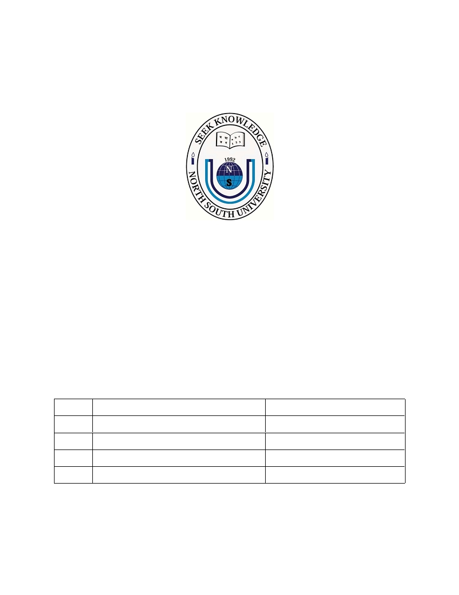
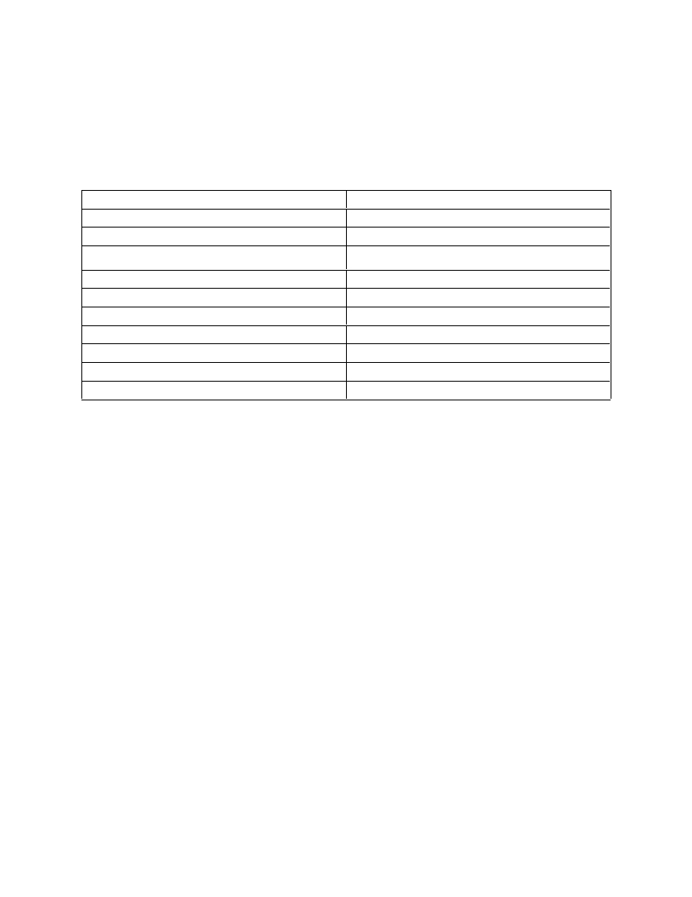
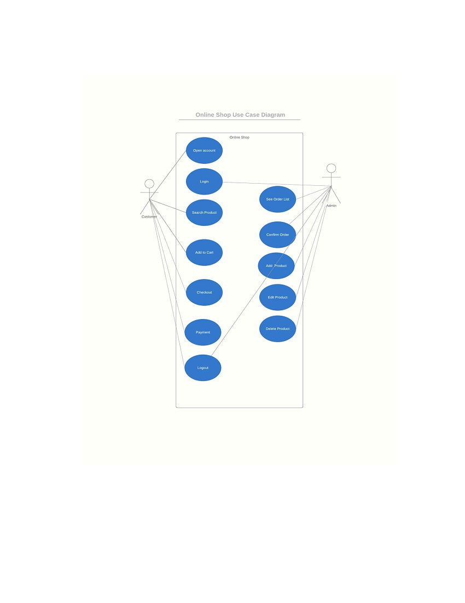
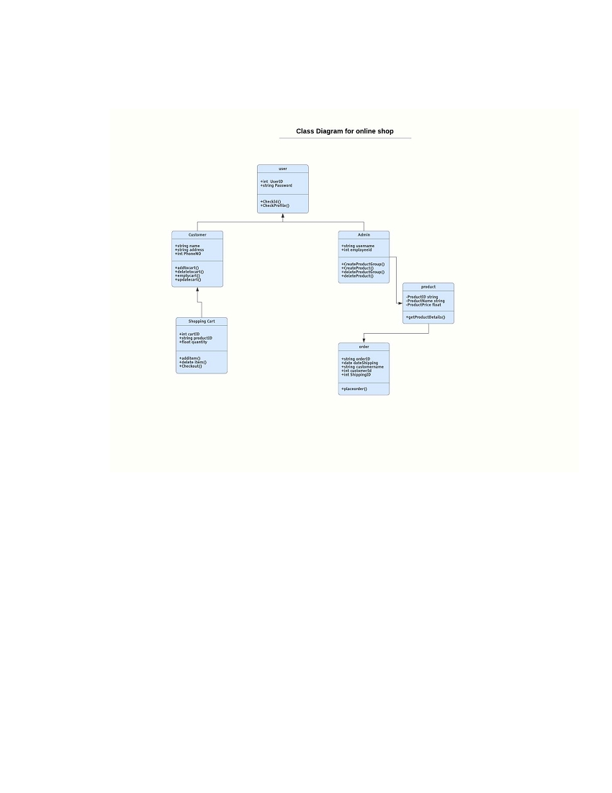

<html>
<head>
<title>D:\uploadedFiles\328a89726eebb177aa652d08f53b85a-c675968cf62ac87\p1g54jig3b16a31br5pn81k2k12om4.pdf</title>

</head>
<body>
<nobr><nowrap>

NORTH SOUTH UNIVERSITY

Project Proposal

Project Title: Online Shop

Course: Software Engineering (CSE327)

Submitted To                                                                      

AKM Bahalul Haque

Submitted by

Serial Name

ID

1

Azher Uddin

1712351042

2

Omar Faruk

1721776042

3

Bayazid Talukder

1721791042

4

S.M Shouvik Islam

1712767642

Introduction

In our daily life we required a lot of accessories from different places. Online shopping is a 

platform where we can get our desire things from far and save our time. We can search what 

need and compare which product is better than other. So, this project is an E-commerce site by 

which people can buy mobile, computer, camera and some other accessories.

Problems

People can&#146;t buy their desire things because of distance. 

Customer can&#146;t get their product by comparing with others.

There are issues like when we order things and after receiving the order product is completely 

different product.

When search for things they don&#146;t get their all product from similar Categories.

Solution

People can buy their desired product via online. If the order is confirmed by customer then 

product manager will send this from courier service. So, customer can easily get the product.

We will provide cash on delivery payment and then online payment by-bKash, Rocket.

They can buy product by checking review and rating.

Category will help them finding product.

If customer have any complain for the product, they can return it within 7 days.

   Stakeholders

&#160; Customers

&#160; Owner of company

&#160; Authority

-Manager

-Accounts department

-IT department

-HR department

&#160; Product Supplier

&#160; Stuffs

-product manager

-delivery boy

&#160; Bank

-Mobile banking

-Credit card, VISA card

&#160; Mobile Company

o Robi

o Grameenphone

o Airtel

o Banglalink

o Taletalk

&#160; Courier Service (cash on delivery)

Survey questions

# Do you think online payment or cash on delivery is okay for the system?

# Do you think rating and review will help you to find quality products?

# Do you think category will help you to find similar products?

#Do you want search option for the system?

# Do you need offers for regular customers or people who buy a certain amount of product?

#  Do you need  a complain system for this web applications?

# Do you want to confirm your order by receiving message or email?

# What extra feature do you need for the system?

Requirement collected

&#160; Login

&#160; online order  

&#160; online payment

-bKash

-Roket

- Bank

&#160; cash on delivery payment

&#160; rating

&#160; review

&#160; category

&#160; complain

&#160; search

&#160; product return( if quality isn&#146;t good enough)

&#160;  Add Users Option to the Admins 

&#160; Delete Users Option to the Admins 

&#160;  Update Users Details Option to the Admins 

&#160; Complain List Accessed by Admins

&#160;  Advertisement to the Users by the Admins

&#160; Log out

Requirements

Functional requirement

&#160; Login

&#160; Online order

&#160; Payment

&#160; Rating

&#160; Review

&#160; Complain

&#160; Categories

&#160; Search

Non-functional requirement

&#160; Login- capcha, 2-factor authentication

&#160; Payment-cash on delivery, bKash , Rocket

&#160; Searching- Will not be case sensitive, recommendation

&#160; Order confirmation- via email, message

&#160; Complain-via email

&#160; Review-comment

&#160; Product return-within 7 days

User Stories

As an owner I want Security so that no one can interrupt our website.

As an authority we want admin panel so that we can see the orders and customer details.

As an authority we want user registration system so that we can give them offer update.

As an authority we want auto reply chat box for customers.

As a customer I want online payment so that I can pay from distance.

As a customer I want product comparison so that I can get better product.

As a customer I want review system so that I can buy products by checking the reviews.

As a customer I want cash on delivery so that I can pay by cash.

As a customer I want search option so that I can find the product earliest possible time.

As a customer I want category system so that we can find out similar products.

As a customer I want live customer support via live call.

As a customer I want tutorial of how to use the product in details section so that I can easily use 

this.

Breakdown Stories to Task

Admin panel -       Login for admin, observing order, confirm, manage product order (update,

                                 Delete, give offer info)

User panel-            Purchase order, edit profile, add product to card, card to checkout confirm.

Payment-               Cash on delivery, mobile banking.

Categories-          Category will help to find out similar product.

Review-               By comment section.

Search -               Search option will be available for find out product easily and shortest possible 

 time. We will use AI (artificial intelligence) so that the user will see the suggestion 

with every letter they write in the search option.

Task priority

                 User Stories

                     Points

1.Admin Panel

100

2.User Profile

98

3.Payment 

100

4.Categories

80

5.Chat box

78

6.Review

70

7.Search

85

8.Customer&#146;s call 

40

9. Product Compare

60

10. Tutorial

50

Prioritized Requirement

&#160; Admin Panel

&#160; Payment

&#160; User Profile

&#160; Search

&#160; Categories

&#160; Chat Box

&#160; Review

&#160; Product Compare

Tools

&#160; Sublime text

&#160; Visual Code Studio

&#160; Xampp

Languages

&#160; HTML5

&#160; CSS3

&#160; Bootstrap4

&#160; Laravel

&#160; PHP

&#160; MySQL

Use Case Diagram

UML Class Diagram

GitHub R epository Link:  https://github.com/OmarFBasit/Online_Shop.git

</nowrap></nobr>
</body>
</html>
